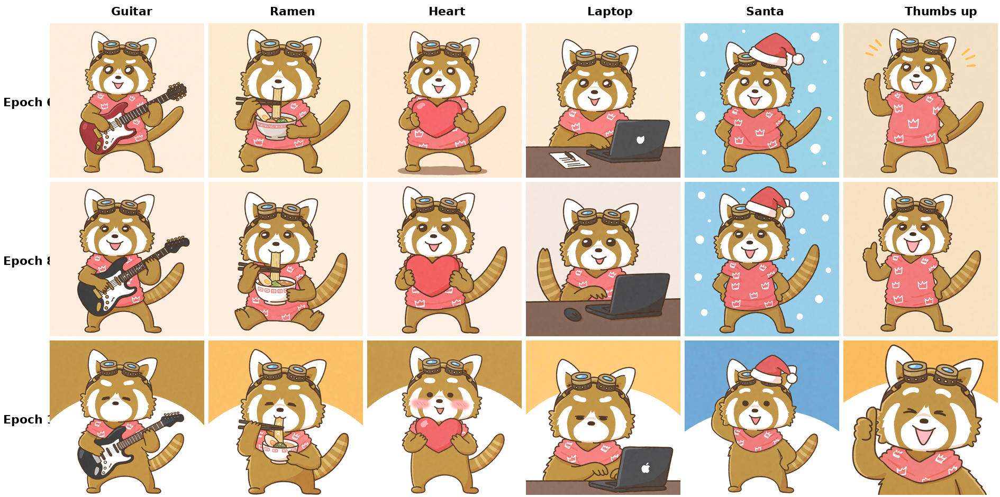

# krea2-character-lora

**LoRA fine-tuning of a 12B-parameter image generation model (Krea 2 / Qwen-Image MMDiT) for a personally-created character, on a single consumer-grade 12 GB GPU.**

This repository accompanies the technical report *"LoRA Fine-Tuning of a 12B-Parameter Image Generation Model for a Personally-Created Character: FP8 Quantization and Block Swapping on a Single Consumer-Grade GPU, and Transfer to a Distilled Model"* (Masato Suzuki / Masafy, 2026). It is the successor to a prior study that fine-tuned the same character on Stable Diffusion 1.5.

The subject is **"Masafee"**, an original red-panda character created by the author and published as a messaging-app sticker set. The goal is to generate unrecorded poses and scenes of the character without additional hand-drawing.

---

## TL;DR

- A **12-billion-parameter** MMDiT (Krea 2) was LoRA-fine-tuned on a **single NVIDIA RTX 3060 (12 GB VRAM)** — a model whose bf16 weights alone (~24 GB) do not even fit on the GPU.
- Feasibility required the joint use of **FP8 scaled quantization + block swapping (26 blocks) + PyTorch `expandable_segments`**. Without the fragmentation mitigation, training failed at step 2.
- The LoRA was trained on the pre-distillation **RAW** model and transfers cleanly to **8-step Turbo** inference.
- Training: 13 reference images, 1,300 steps, **8 h 23 m**, ~23.2 s/step, final loss 0.0269. Peak VRAM ~11.9 GB / 12 GB. No paid cloud resources.
- Finding: overfitting is **frequency-asymmetric** — high-frequency details (eye catchlights) erode before the low-frequency overall form, and the loss is reversibly recovered at inference time via LoRA strength and text conditioning.

## Results at a glance

| Item | Value |
|---|---|
| Base model (training) | Krea 2 RAW (~12B params, single-stream MMDiT, flow matching) |
| Base model (inference) | Krea 2 Turbo, 8-step distilled (GGUF Q5_K_M) |
| Text encoder / VAE | Qwen3-VL-4B / Qwen-Image VAE |
| GPU | NVIDIA GeForce RTX 3060, 12 GB VRAM |
| Memory strategy | FP8 scaled + block swap 26 + `expandable_segments` |
| LoRA | rank 32, alpha 32, AdamW, lr 1e-4, 1,300 steps (10 epochs) |
| Training time / throughput | 8 h 23 m / ~23.2 s/step |
| Peak VRAM | ~11.9 GB (≈97% of 12 GB) |
| Recommended setting | epoch 10, LoRA strength λ=0.8, + eye-highlight prompt |



## Repository layout

```
paper/      Technical report (LaTeX + PDF, JA & EN) and figures
lora/        LoRA weights — hosted on Hugging Face (see lora/README.md)
dataset/    13 training images of "Masafee" + tag captions (trigger: masafee)
scripts/    Training launcher, dataset config, ComfyUI inference workflow
samples/    Generated samples (pose grid, identity, eye-catchlight study)
logs/        Provenance, training-loss curve, GPU telemetry
```

## Model weights

The LoRA checkpoints (epochs 6 / 8 / 10, ~448 MB each) are hosted on Hugging Face:

> **https://huggingface.co/masafykun/krea2-character-lora**

Download via `scripts/download_lora.sh` or the `huggingface_hub` library. The recommended checkpoint is **epoch 10** used at **strength 0.8** together with an eye-highlight prompt (see the report, §Results).

## Reproduction

1. Install [Musubi Tuner](https://github.com/kohya-ss/musubi-tuner) (this work used commit `30c658c`).
2. Obtain the base models: Krea 2 RAW (`krea/Krea-2-Raw`), Qwen3-VL-4B (`Comfy-Org/Qwen3-VL`), Qwen-Image VAE (`Comfy-Org/Qwen-Image_ComfyUI`). These are **not** redistributed here (subject to their own licenses).
3. Place the 13 images + captions from `dataset/` and use `scripts/dataset.toml`.
4. Precache latents and text-encoder outputs, then run `scripts/run_train.sh`.
5. For inference, load `scripts/inference_workflow_comfyui.json` in ComfyUI (Krea 2 Turbo + the LoRA).

Exact versions and hyperparameters are recorded in `logs/run_info.txt` and the report's appendices.

## Citation

```bibtex
@techreport{suzuki2026krea2lora,
  author = {Masato Suzuki},
  title  = {LoRA Fine-Tuning of a 12B-Parameter Image Generation Model for a Personally-Created Character},
  year   = {2026},
  note   = {Consumer-grade single-GPU study; FP8 quantization, block swapping, and RAW-to-Turbo transfer}
}
```

## License

- **Code** (`scripts/`, repository tooling): MIT — see [LICENSE](LICENSE).
- **Paper, figures, and generated samples**: CC BY 4.0.
- **LoRA weights** and the **base model**: the LoRA is a derivative of Krea 2 and is subject to the **Krea 2 Community License**; see [NOTICE.md](NOTICE.md).
- The character "Masafee" and the training images are the intellectual property of the author.

---

## 日本語概要

本リポジトリは、技術報告「12Bパラメータ画像生成モデルへのキャラクタLoRA微調整——消費者向け単一GPU上でのFP8量子化とブロックスワップ、および蒸留モデルへの転移——」（鈴木将人 / Masafy, 2026）に付随するものである。著者の個人制作キャラクター「マサフィー」（レッサーパンダ）を主題とし、**約120億パラメータのKrea 2（Qwen-Image系MMDiT）を、VRAM 12 GBのRTX 3060単体でLoRA微調整**した記録一式を収める。

鍵は **FP8スケール量子化＋ブロックスワップ26＋`expandable_segments`** の併用であり、これにより半精度では重みすら載らない12Bモデルの学習を12 GBに収めた。蒸留前のRAWで学習し、8ステップ蒸留版Turboへ良好に転移する。論文（日英）・図・再現スクリプト・学習データ・生成サンプル・provenanceログを含む。LoRA重みはHugging Faceで配布する。
